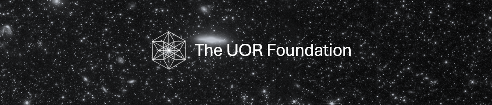

  

  <strong>Your universal coordinate system for information.</strong>

  
  
  
  

  <a href="https://www.uor.foundation/">About us</a> · <a href="https://discord.gg/ZwuZaNyuve">Join us</a> · <a href="https://github.com/UOR-Foundation/research">Build with us</a>

---

| **Research Highlight** |
| :---: |
| ATLAS: The Physics of Information |
| [**Read more →**](https://www.uor.foundation/theory) |

---

**The UOR Foundation**

The UOR Foundation is dedicated to advancing research, technology, and community—building tools and frameworks that create lasting impact.

---

**Getting Started**

**Need an API key?**  
[Visit the UOR Platform](https://www.uor.foundation/)

**Want to get involved?**  
[Join your Community](https://discord.gg/ZwuZaNyuve)

**Resources**
- Documentation (coming soon)
- [Community](https://discord.gg/ZwuZaNyuve)
- [Archive](https://github.com/The-UOR-Foundation-Archive)

---

**Blog**

Visit the [blog](https://www.uor.foundation/blog) for updates.
